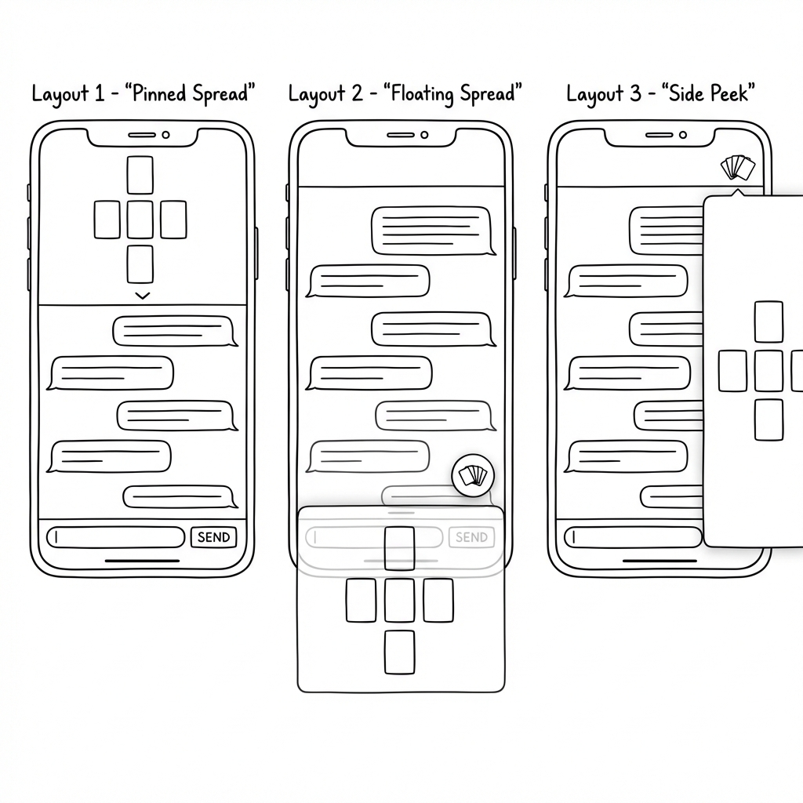
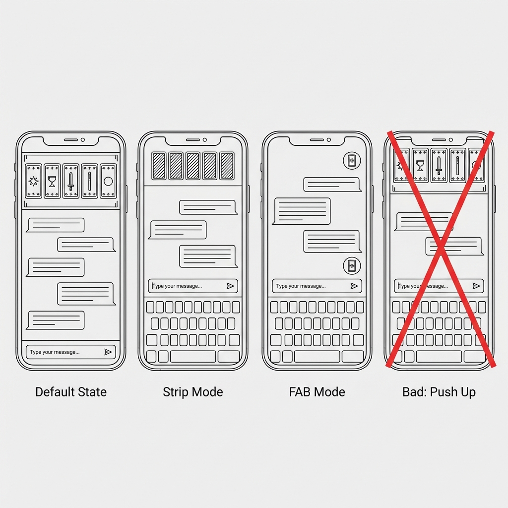
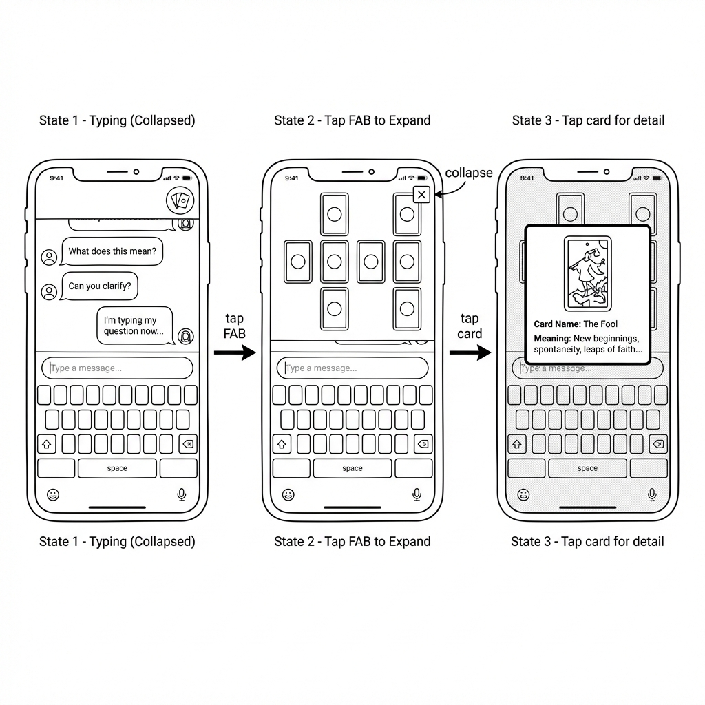

# Tarot App — Mobile UI Specification

This document defines the mobile-first UI for the AI Tarot Reader MVP. The design prioritizes **simultaneous access to spread and conversation** while maintaining a fluid chat experience.

---

## Design Philosophy

- **AI-first**: The core experience is a conversation with an AI reader, not a manual tool
- **Mobile-native**: Designed for portrait mobile screens; desktop is a secondary concern
- **Spread visibility**: The active spread should be accessible without leaving the conversation
- **Low friction**: Minimize taps to access information; keyboard should never block essential context

---

## Layout States

### 1. Default View (Spread Pinned)

The primary layout when reading and conversing.



| Region | Content |
|--------|---------|
| **Top ~25%** | Pinned spread viewer (compact cards + position dots) |
| **Middle** | Chat messages (scrollable, newest at bottom) |
| **Bottom** | Text input field + send button |

**Spread viewer features:**
- Cards displayed at compact size (recognizable but not detailed)
- Spread label shows question/title
- If multiple spreads: ← → navigation arrows + dot indicator
- Tap anywhere on spread → expand to fullscreen

---

### 2. Typing Mode (Keyboard Active)

When the keyboard appears, maximize chat visibility while keeping spread accessible.



**Behavior:**
1. Spread **auto-collapses to FAB** (floating action button) in top-right corner
2. Chat area expands to fill available space above keyboard
3. User can tap FAB to **re-expand spread** while keyboard remains open

---

### 3. Typing + Spread Expanded

User wants to reference the spread while composing their message.



**Flow:**
1. User is typing (keyboard open, spread collapsed to FAB)
2. Taps FAB → spread expands to top ~30% of screen
3. Chat area shrinks but remains visible with recent messages
4. Optionally: tap a card → card detail modal appears
5. Tap X on spread or outside → collapse back to FAB

---

### 4. Fullscreen Spread View

For detailed card inspection outside of typing mode.

**Trigger:** Tap on pinned spread when keyboard is closed

**Features:**
- Spread takes full screen (modal overlay)
- Cards displayed at full size
- Tap individual card → card detail with:
  - Card image (large)
  - Card name + orientation (upright/reversed)
  - Card meaning
  - Position meaning
- Swipe or tap outside → dismiss to default view

---

### 5. Multi-Spread Navigation

When session contains multiple spreads (follow-up questions, clarifications).


| Element | Behavior |
|---------|----------|
| **← / → Arrows** | Navigate between spreads (only visible when >1 spread) |
| **Dot indicator** | Shows position (e.g., ●○○ = first of three) |
| **Spread label** | Updates to show question/title for current spread |

**Order:** Chronological (oldest left, newest right). The most recent spread is always visible by default.

---

## Component Breakdown

### SpreadViewer
- Renders cards in layout grid based on `layout_descriptor`
- Adapts card size to available width
- Handles expand/collapse state
- Emits: `onCardTap(cardIndex)`, `onExpandRequest`, `onCollapseRequest`

### SpreadNavigator
- Renders ← → arrows and dot indicator
- Tracks `currentSpreadIndex` and `totalSpreads`
- Emits: `onNavigate(direction)`

### ChatPanel
- Scrollable message list
- Auto-scroll on new messages
- Message types: user, assistant, system (spread laid notification)
- Typing indicator for AI responses

### CardDetailModal
- Overlay showing single card details
- Displays: card image, name, orientation, meaning, position meaning
- Dismiss on tap outside or swipe down

### SpreadFAB (Floating Action Button)
- Small circular button showing spread icon or card-stack glyph
- Badge showing spread count if >1
- Fixed position (top-right of chat area)
- Tap → expand spread

---

## State Machine

```
┌─────────────────────┐
│   DEFAULT VIEW      │
│ (Spread pinned,     │
│  chat visible)      │
└──────────┬──────────┘
           │
     ┌─────┴─────┬──────────────┐
     │           │              │
     ▼           ▼              ▼
┌─────────┐ ┌─────────┐   ┌──────────┐
│ TYPING  │ │FULLSCREEN│  │MULTI-    │
│ MODE    │ │ SPREAD   │  │SPREAD    │
│(FAB only)│ │  VIEW   │  │NAVIGATE  │
└────┬────┘ └─────────┘   └──────────┘
     │ tap FAB
     ▼
┌──────────────┐
│ TYPING +     │
│ SPREAD OPEN  │
│ (keyboard +  │
│  spread both │
│  visible)    │
└──────────────┘
```

**Transitions:**
- Keyboard appears → auto-collapse spread to FAB
- Keyboard dismisses → auto-expand spread to pinned position
- Tap FAB (while typing) → expand spread, keep keyboard
- Tap X on expanded spread → collapse to FAB
- Tap spread (when not typing) → fullscreen modal
- Swipe L/R on spread → navigate multi-spread

---

## Responsive Considerations

### Mobile (Primary Target)
- Portrait orientation assumed
- Bottom 40% reserved for keyboard when typing
- Minimum touch targets: 44×44 pts

### Tablet / Desktop (Secondary)
- Could use side-by-side layout (spread left, chat right)
- Not in MVP scope — default to mobile layout scaled

---

## Animation Guidelines

| Transition | Duration | Easing |
|------------|----------|--------|
| Spread collapse → FAB | 250ms | ease-out |
| FAB → Spread expand | 300ms | ease-in-out |
| Spread navigate (L/R) | 200ms | ease-in-out |
| Card flip (reveal) | 400ms | ease-in-out |
| Modal appear/dismiss | 250ms | ease-out |

All animations should respect `prefers-reduced-motion`.
